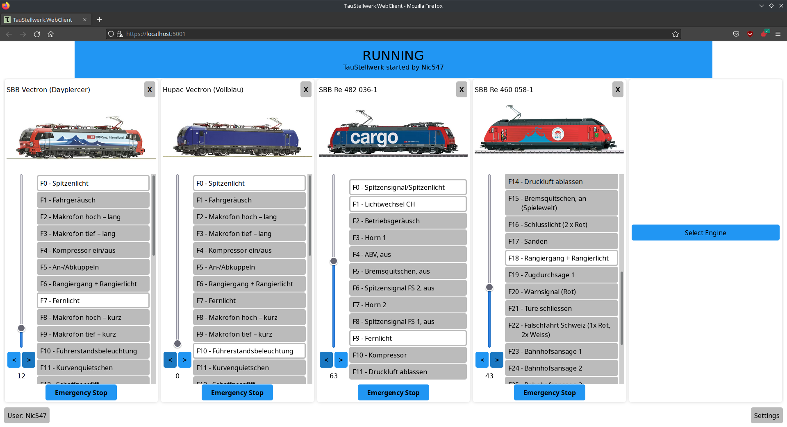
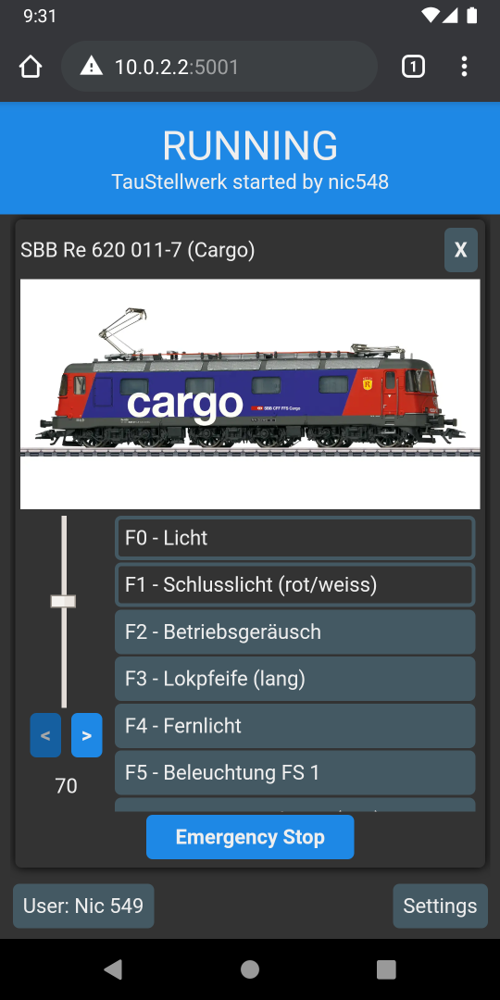
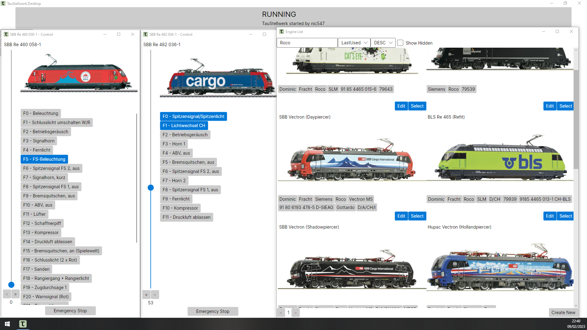

# TauStellwerk
A collection of Software cantered around "Teppichbahning" ("Carpet Railroading"), temporary model railways with changing layouts, users, devices and trains with little automation.
The end-goal is a simple user interface, fast setup, solid handling of multiple users and supporting most platforms.
Currently the project consists of a server application with a included web-based client as well as a sperate desktop client, all based on .NET.

If you have any questions, feedback or any other comments, feel free to open a issue or pm me(nic547#2614) on discord.

## Current State
The software is still in a very experimental state. Currently only the ESU Command Station (ECoS) is supported.
If you're interested in using this project, you should understand that things might break. 

## Overview

Currently the whole project is based on .NET 6.
No ready-to-use builds of the project are provided yet.

#### MacOS/iOS
Using the cross-platform .NET software framework does mean that the TauStellwerk-Software should run on MacOS/iOS. Unfortunately  I do not have access to either OS, so I cannot support either OS.

### Webserver
Core of the TauStellwerk software is the TauStellwerk.Server component. It handles communication between the CommandStation and the clients. Can, for example, be run on a Raspberry Pi.

For the sake of simplicity, there are no "accounts". Any user can choose whatever username he desires. Access control has be done by restricting access to the server.

### Webapp
The Webapp is based on Blazor WebAssembly and should run on any recent version of the commonly used Browsers. Generally the application is tested with current versions of Chrome, Firefox and Edge. It's expected that the webapp will not necessarily have feature-parity with the dedicated applications and be more of a "lite" version.

### Desktop Application
Uses .NET and AvaloniaUI. Connects to the TauStellwerk.Server. Tested on Linux and Windows.

### Mobile App
Not started yet. Should be using .NET MAUI. Currently waiting until we get closer to the release of MAUI.

## Licences
Unless noted otherwise, this project is licensed under the GNU GPLv3, see [here](/LICENSE) for more details.

## Contributing
All contributions are welcome. As I'm currently the sole user and developer, documentation isn't a huge focus for me, so feel free approach me with any potential questions.