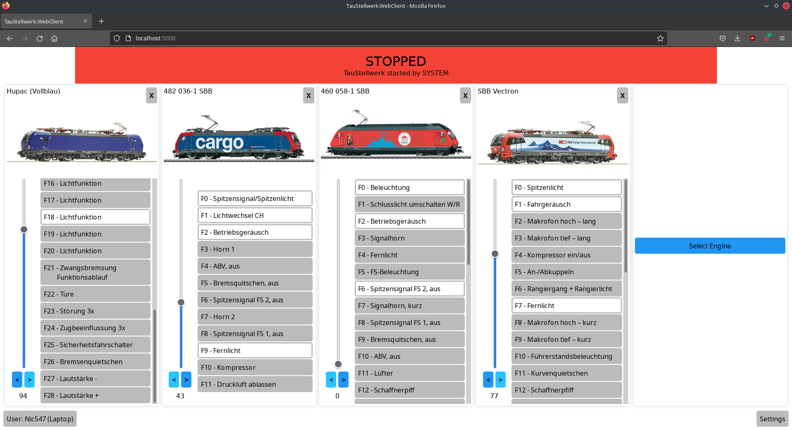

# TauStellwerk
A collection of Software cantered around "Teppichbahning" ("Carpet Railroading"), temporary model railways with changing layouts, users, devices and trains.
The end-goal is a simple user interface, fast setup, solid handling of multiple users and supporting most platforms.
No support for automatization or feedback modules is planned at this point in time.

## Current State
The software is still in a very experimental state. If you're interested in using this project, you should understand that things will break.
Currently only the ESU Command Station (ECoS) is supported.

## Important Notes
- This is just a hobbyist's project. I guarantee absolutely nothing.
- Restrict network access to the server. Do not use a public Wi-Fi and do not make the server accessible from the internet.

## Overview
Currently only the "ESU Command Station" (ECoS) is supported. Support for other Command Stations is blocked by a lack of Hardware.

### Webserver
The Webserver runs on .NET, currently Version 5.0. It should be able to run on Windows, GNU/Linux and MacOS and supports both x86 and ARM processors.
The TauStellwerk server uses a SQLite-database to keep it's data.

There's no user authentication, as managing user accounts does not align with the goals of this project. Instead Users can freely chose a username and access control should happen on a network level.

For the optional image processing the server relies on the ImageMagick suite. It is not included and should be installed separately if desired. Both IMv6 and IMv7 are supported, as many Linux distributions still only provide the older version in their repos.

### Webapp
The Webapp is a Blazor WebAssembly Application. It's best regarded as a "lite" version of the fully featured "native" applications.

## Licences
- Unless noted otherwise, this project is licensed under the GNU GPLv3, see [here](/LICENSE) for more details.

## Next steps:
- Mobile App using MAUI (depends on the Release of .NET 6)
- Switches