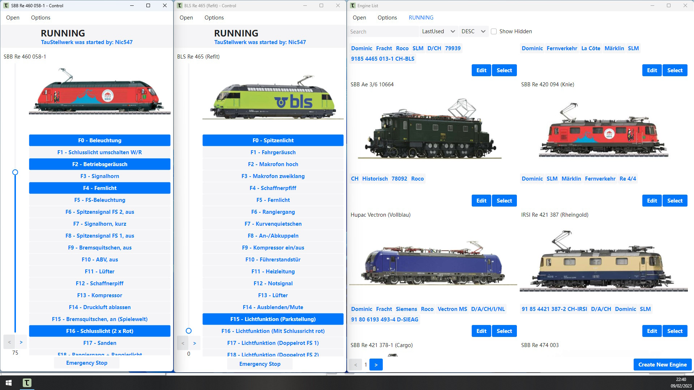

# TauStellwerk

TauStellwerk is a open-source software project for controlling model railways.
It is intended to provide a intuitive user interface for easy and quick edits and control of a model railway.
It is not intended to be a competitor to more complex software like JMRI, TrainController or similar, but rather
an alternative to manufacturer-provided applications.

If you have any questions, feedback or any other comments, feel free to open a issue or pm me(nic547) on discord.

## Overview

The software is still in an experimental state. There might be some fundamental changes that break existing databases or installations.
Currently there are no prebuilt binaries available.

Currently supported Command Stations:

- ESU Command Station (ECoS)
- DCC++ EX (via USB)

### MacOS/iOS

Using the cross-platform .NET software framework does mean that the TauStellwerk-Software should run on MacOS/iOS. Unfortunately I do not have access to either OS, so I cannot test on either OS.

### Webserver

Core of the TauStellwerk software is the TauStellwerk.Server component. It handles communication between the CommandStation and the clients. Can, for example, be run on a Raspberry Pi.

For the sake of simplicity, there are no "accounts". Any user can choose whatever username he desires. Access control has be done by restricting access to the server.

### Webapp

The Webapp is based on Blazor WebAssembly and should run on any recent version of the commonly used Browsers. Generally the application is tested with current versions of Chrome, Firefox and Edge. It's expected that the webapp will not necessarily have feature-parity with the dedicated applications and be more of a "lite" version.

### Desktop Application

Uses .NET and AvaloniaUI. Connects to the TauStellwerk.Server. Tested on Linux and Windows.

### Mobile App

Planned but not started. Initially MAUI was intended to be used, currently waiting to see how MAUI vs UNO vs AvaloniaUI for mobile apps pans out.

## Licences

Unless noted otherwise, this project is licensed under the GNU GPLv3, see [here](/LICENSE) for more details.

## Contributing

All contributions are welcome. As I'm currently the sole user and developer, documentation isn't a huge focus for me, so feel free approach me with any potential questions.

## Acknowledgements

JetBrains has been kind enough to provide me with a free open-source license for their products as part of their [open source support program](https://jb.gg/OpenSourceSupport). I'm using Rider for development and can only recommend it.