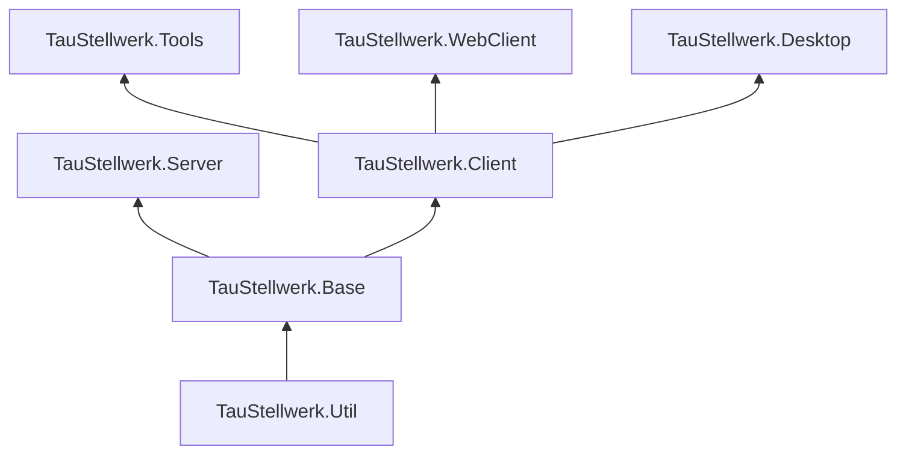

# Development Guide

## Building the applications

Building the project (currently) requires the .NET 8 SDK.
Because the project relies on information from it's git history for generating it's version number, copies/clones need to include the full git history*

(*technically you only need the history up to the last commit that changed the version.json file, but that's a bit annoying to handle.)

The project can then be built via `dotnet build`. The specific versions of dependencies defined in the .csproj-files will be downloaded automatically via NuGet.

To create the builds ready for distribution the python script `publish.py` is provided in the project root. It should run with any recent version of python and builds the self-contained binaries for the different platforms and packages them into .tar.gz and .zip-files.

## IDE

Generally the dotnet-CLI and any text editor are good enough to develop a .NET application. Personally I would recommend using one of the following:

- [JetBrains Rider](https://www.jetbrains.com/rider/) (paid with free licenses for students and open-source maintainers, runs on linux, macos and windows)
- [Microsoft Visual Studio](https://visualstudio.microsoft.com/) (free up to a certain revenue, windows-exclusive)
- [VSCode](https://code.visualstudio.com/Download) with the [C# Extension](https://code.visualstudio.com/Docs/languages/csharp) (free, runs on linux, macos and windows, might be not quite as advanced as the prior two options)

## Basic Architecture

A slightly simplified Overview over the projects:

- TauStellwerk.Util: This projects contains thing that could be useful in any context, even outside of TauStellwerk. Extension methods, special containers, etc.
- TauStellwerk.Base: Contains code that is shared across Server and Clients, but is probably not useful for anyone not working on model railroad software. Things like custom types and dtos go here.
- TauStellwerk.Server: Server components, contains the ASP.NET Core parts, takes care of persistance via EF Core and communicates with the CommandStation Hardware.
- TauStellwerk.Client: Library shared by all client applications.
- TauStellwerk.WebClient: The Blazor WebAssembly client. Used by the server application, not necessarily feature complete.
- TauStellwerk.Desktop: The Desktop application using AvaloniaUI.

For most projects there's also a associated .Test project that, as the name implies, contains test for the project. 